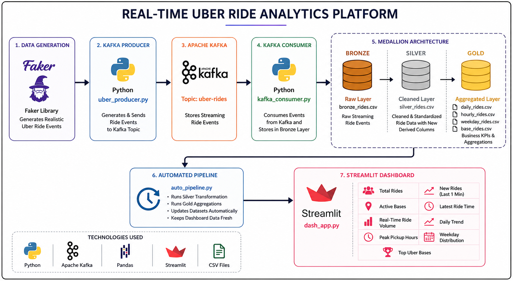
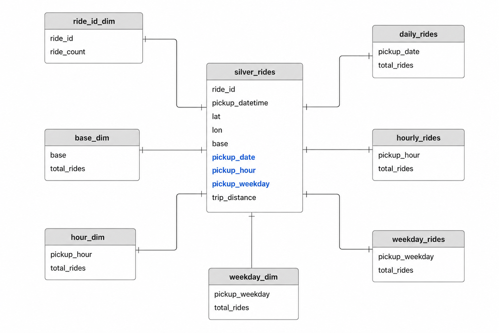

# 🚖 Real-Time Uber Ride Analytics Platform

An end-to-end Real-Time Data Engineering project that simulates Uber ride events using Apache Kafka and processes streaming data through a Medallion Architecture (Bronze → Silver → Gold) before visualizing business insights through an interactive Streamlit dashboard.

---

## 📌 Project Overview

This project demonstrates how real-time ride events can be generated, streamed, processed, transformed, and visualized using modern data engineering concepts.

The system continuously generates synthetic Uber ride events using the Faker library. These events are streamed through Apache Kafka, consumed by a Kafka Consumer, stored in the Bronze Layer, transformed into the Silver Layer, aggregated into Gold Layer datasets, and finally displayed through a real-time Streamlit dashboard.

---

## 🏗️ Architecture Diagram



---

## 📊 Data Model



---

## 🔄 End-to-End Data Flow

```text
Faker
   ↓
Kafka Producer
   ↓
Apache Kafka Topic (uber-rides)
   ↓
Kafka Consumer
   ↓
Bronze Layer (bronze_rides.csv)
   ↓
Silver Layer (silver_rides.csv)
   ↓
Gold Layer
   ├── daily_rides.csv
   ├── hourly_rides.csv
   ├── weekday_rides.csv
   └── base_rides.csv
   ↓
Streamlit Dashboard
```

---

## 🥉 Bronze Layer

### bronze_rides.csv

Stores raw ride events consumed from Kafka.

Columns:

- ride_id
- pickup_datetime
- lat
- lon
- base

Purpose:

- Landing zone for incoming ride events
- Stores raw streaming data
- Source for Silver Layer processing

---

## 🥈 Silver Layer

### silver_rides.csv

Stores cleaned and transformed ride events.

Additional derived columns:

- pickup_date
- pickup_hour
- pickup_weekday

Purpose:

- Data cleaning
- Data standardization
- Feature engineering
- Source for Gold Layer aggregations

---

## 🥇 Gold Layer

Business-ready aggregated datasets used by the dashboard.

### daily_rides.csv

Daily ride counts.

### hourly_rides.csv

Ride counts grouped by pickup hour.

### weekday_rides.csv

Ride counts grouped by weekday.

### base_rides.csv

Ride counts grouped by Uber base.

Purpose:

- Dashboard reporting
- KPI generation
- Business analytics

---

## ⚙️ Automated Pipeline

The project includes an automated ETL pipeline using:

### auto_pipeline.py

Responsibilities:

- Runs Silver Layer transformations
- Runs Gold Layer aggregations
- Refreshes datasets automatically
- Keeps dashboard metrics updated

This ensures that newly arriving ride events are reflected in the dashboard without manual intervention.

---

## 📈 Dashboard Features

### KPI Metrics

- Total Rides
- New Rides (Last 1 Minute)
- Active Bases
- Latest Ride Time

### Interactive Visualizations

- Real-Time Ride Volume
- Daily Ride Trend
- Peak Pickup Hours
- Weekday Ride Distribution
- Top Uber Bases

---

## 📷 Dashboard Screenshots

### Dashboard Overview


> Additional screenshots can be added to the `dashboard_Screenshot` folder and referenced here.

---

## 🛠️ Technology Stack

| Technology | Purpose |
|------------|----------|
| Python | Core Development |
| Apache Kafka | Real-Time Streaming |
| Faker | Ride Event Generation |
| Pandas | Data Processing |
| Streamlit | Dashboard Development |
| Plotly | Interactive Visualizations |
| Git | Version Control |
| GitHub | Repository Hosting |

---

## 📂 Project Structure

```text
Uber_Realtime_Ride_Analytics
│
├── producer/
│   └── uber_producer.py
│
├── consumer/
│   └── kafka_consumer.py
│
├── dashboard/
│   └── dash_app.py
│
├── dashboard_Screenshot/
│   └── dashboard.png
│
├── data/
│   ├── bronze/
│   │   └── bronze_rides.csv
│   │
│   ├── silver/
│   │   └── silver_rides.csv
│   │
│   └── gold/
│       ├── daily_rides.csv
│       ├── hourly_rides.csv
│       ├── weekday_rides.csv
│       └── base_rides.csv
│
├── auto_pipeline.py
├── silver_transform.py
├── gold_transform.py
├── architecture.png
├── data_model.png
├── requirements.txt
├── README.md
└── .gitignore
```

---

## 🚀 Installation

```bash
git clone https://github.com/PiyushHere01/Uber_Real-Time_Ride_Analysis.git

cd Uber_Real-Time_Ride_Analysis

pip install -r requirements.txt
```

---

## ▶️ Run the Project

### Start Kafka Producer

```bash
python producer/uber_producer.py
```

### Start Kafka Consumer

```bash
python consumer/kafka_consumer.py
```

### Start Automated Pipeline

```bash
python auto_pipeline.py
```

### Launch Dashboard

```bash
streamlit run dashboard/dash_app.py
```

---

## 🎯 Key Learnings

- Real-Time Data Streaming using Apache Kafka
- Event-Driven Architecture
- Medallion Data Architecture
- Data Transformation using Pandas
- Automated ETL Pipelines
- Real-Time Dashboard Development
- Git & GitHub Version Control

---

## 🚀 Future Enhancements

- Apache Spark Streaming Integration
- Databricks Integration
- Cloud Deployment (AWS/Azure/GCP)
- Real-Time Alerting System
- Advanced Ride Analytics

---

## 👨‍💻 Author

### Piyush Srivastava

GitHub: https://github.com/PiyushHere01

---

⭐ If you found this project useful, consider giving it a star on GitHub.
